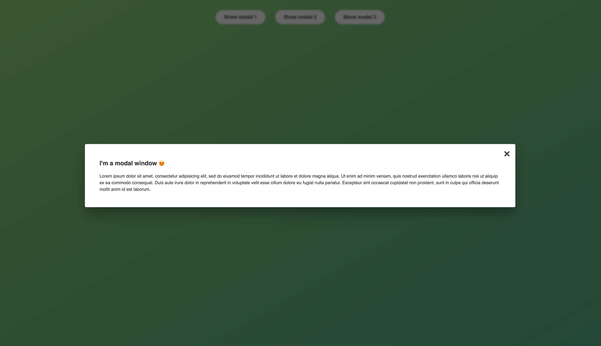

# DOM-modal

       for (let i = 0; i < modals.length; i++) {
         document.querySelectorAll('.show-modal')[i].addEventListener('click', function () {
           document.addEventListener("keydown",function (e) {
             if(e.key === "Escape"){
              document.querySelector('.modal').classList.add('hidden');
              document.querySelector('.overlay').classList.remove('hidden');
            }
          })
        }

